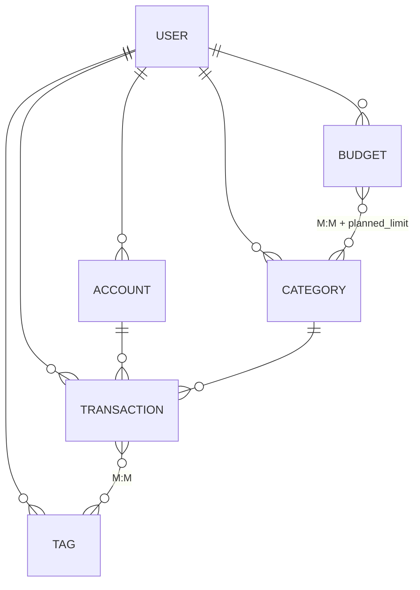

# Лабораторная работа 1. Серверное приложение на FastAPI

**Студент:** Майстренко Анастасия, гр. К3341
**Тема:** сервис управления личными финансами
**Задание:** <https://rendex85.github.io/WebDevelopmentLabsDocs/lr2/lr2/>

Серверное приложение для учёта личных финансов: счета, категории доходов и
расходов, транзакции с тегами, бюджеты с лимитами по категориям. Доступ к данным
защищён аутентификацией по JWT.

## Стек

FastAPI · SQLModel · PostgreSQL · Alembic · python-jose (JWT) · passlib/bcrypt ·
pydantic-settings · uvicorn.

## Структура

```text
Lr1/
├── code/                     # основное приложение (задание ЛР)
│   ├── app/
│   │   ├── core/             # конфиг, подключение к БД, безопасность (JWT/хеши)
│   │   ├── models/           # таблицы SQLModel (8 шт.)
│   │   ├── schemas/          # модели запросов/ответов (в т.ч. вложенные)
│   │   ├── api/{deps.py,routes/}  # зависимости и роутеры по доменам
│   │   └── main.py           # точка входа FastAPI
│   ├── migrations/           # Alembic
│   ├── alembic.ini · requirements.txt · .env.example · .gitignore
├── practice/practice_1_inmemory/   # Практика 1 (FastAPI без БД)
├── docs/ + mkdocs.yml        # отчёт (GitHub Pages)
└── README.md                 # этот файл
```

## Запуск

```bash
cd code
python -m venv .venv && source .venv/bin/activate
pip install -r requirements.txt
cp .env.example .env          # поправить DATABASE_URL под свою БД
createdb finance_db
alembic upgrade head          # применить миграции
uvicorn app.main:app --reload
```

Swagger UI: <http://127.0.0.1:8000/docs>.

## Модель данных

8 таблиц, связи 1:M и M:M. Ассоциативная сущность `budget_category_link` имеет
собственное поле `planned_limit`, характеризующее связь бюджет↔категория.



## Выполнение требований

**Базовое задание (9 баллов):** 8 таблиц SQLModel (≥5) · связи 1:M и M:M ·
ассоциативная сущность с полем связи · CRUD с вложенными объектами · PostgreSQL ·
миграции Alembic · полная типизация · структура по доменам.

**Дополнительное (15 баллов):** регистрация/авторизация · генерация и проверка
JWT · хеширование пароля (bcrypt) · эндпоинты профиля, списка пользователей и
смены пароля.

## Отчёт (GitHub Pages)

Отчёт по всем лабораторным собран в единый mkdocs-сайт на уровне студента
(`students/k3341/Maistrenko_Anastasia/`, тема material). Страницы ЛР1 — в разделе
«ЛР1».

```bash
cd ..                       # students/k3341/Maistrenko_Anastasia/
pip install mkdocs-material
mkdocs serve                # локальный просмотр
mkdocs gh-deploy            # публикация на GitHub Pages
```

Опубликованный отчёт: <https://may-na.github.io/ITMO_ICT_WebDevelopment_tools_2025-2026/>
