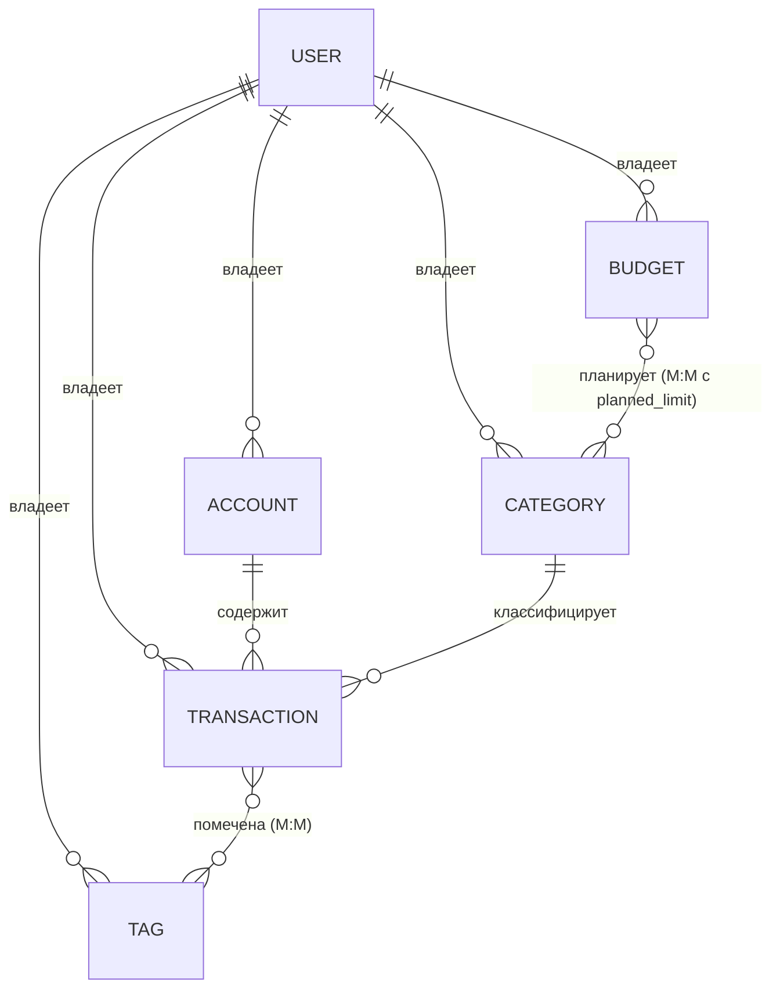

# Лабораторная работа 1. Серверное приложение на FastAPI

**Студент:** Майстренко Анастасия, гр. К3341
**Тема:** сервис управления личными финансами
**Текст задания:** <https://rendex85.github.io/WebDevelopmentLabsDocs/lr2/lr2/>

## О приложении

Серверное приложение для учёта личных финансов: пользователь заводит счета,
категории доходов и расходов, фиксирует транзакции (с тегами) и планирует
бюджеты с лимитами по категориям. Доступ к данным защищён аутентификацией по
JWT — каждый пользователь видит только свои данные.

## Стек технологий

| Назначение            | Инструмент                          |
|-----------------------|-------------------------------------|
| Веб-фреймворк         | FastAPI                             |
| ORM / модели          | SQLModel (поверх SQLAlchemy + Pydantic) |
| СУБД                  | PostgreSQL                          |
| Драйвер БД            | psycopg2-binary                     |
| Миграции              | Alembic                             |
| Переменные окружения  | python-dotenv + pydantic-settings   |
| Хеширование пароля    | passlib + bcrypt                    |
| JWT                   | python-jose                         |
| ASGI-сервер           | uvicorn                             |

## Схема базы данных



Связь **BUDGET ↔ CATEGORY** реализована через ассоциативную таблицу
`budget_category_link`, у которой помимо внешних ключей есть собственное поле
`planned_limit` — запланированный лимит расходов по категории внутри бюджета.
Это и есть «поле, характеризующее связь» из требований ЛР.

## Соответствие требованиям

### Базовое задание (9 баллов)

- [x] **8 таблиц** через ORM SQLModel: `user`, `account`, `category`,
      `transaction`, `budget`, `tag` + связующие `transaction_tag_link`,
      `budget_category_link` (требуется 5+).
- [x] Связи **один-ко-многим** (пользователь → счета/категории/…; счёт →
      транзакции; категория → транзакции).
- [x] Связи **многие-ко-многим**: транзакция ↔ тег, бюджет ↔ категория.
- [x] **Ассоциативная сущность с полем, характеризующим связь** —
      `budget_category_link.planned_limit`.
- [x] **CRUD** для всех сущностей с **возвратом вложенных объектов**
      (см. [Эндпоинты](endpoints.md)).
- [x] **PostgreSQL** + миграции **Alembic**.
- [x] **Типизация** параметров и возвращаемых значений во всех обработчиках.
- [x] Структура проекта **по доменным областям** (`models/`, `schemas/`,
      `api/routes/`, `core/`).

### Дополнительное задание (15 баллов) — аутентификация

- [x] Регистрация и авторизация пользователя.
- [x] Генерация **JWT-токена** и аутентификация по нему.
- [x] **Хеширование пароля** (bcrypt).
- [x] Эндпоинты: информация о пользователе, список пользователей, смена пароля.

## Структура проекта

```text
Lr1/
├── code/                     # основное приложение (задание ЛР)
│   ├── app/
│   │   ├── core/             # конфиг, подключение к БД, безопасность (JWT/хеши)
│   │   ├── models/           # таблицы SQLModel
│   │   ├── schemas/          # модели запросов/ответов (в т.ч. вложенные)
│   │   ├── api/
│   │   │   ├── deps.py       # зависимость аутентификации
│   │   │   └── routes/       # роутеры по доменам
│   │   └── main.py           # точка входа FastAPI
│   ├── migrations/           # Alembic
│   ├── alembic.ini
│   ├── requirements.txt
│   ├── .env.example
│   └── .gitignore
├── practice/
│   └── practice_1_inmemory/  # Практика 1 (FastAPI без БД)
├── docs/                     # этот отчёт (mkdocs)
└── mkdocs.yml
```

## Как запустить

```bash
cd code
python -m venv .venv && source .venv/bin/activate
pip install -r requirements.txt

cp .env.example .env          # при необходимости поправить DATABASE_URL
alembic upgrade head          # применить миграции
uvicorn app.main:app --reload
```

Интерактивная документация Swagger UI: <http://127.0.0.1:8000/docs>.

## Ссылки на код

- Репозиторий: <https://github.com/may-na/ITMO_ICT_WebDevelopment_tools_2025-2026>
- Код приложения: `students/k3341/Maistrenko_Anastasia/Lr1/code`
- Практика 1: `students/k3341/Maistrenko_Anastasia/Lr1/practice/practice_1_inmemory`
