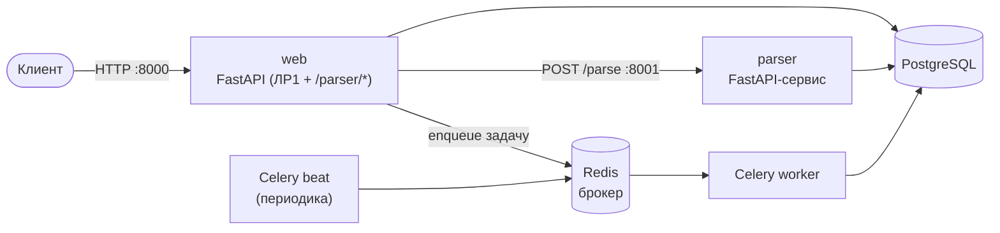

# Лабораторная работа 3. Docker, источники данных и очереди

**Студент:** Майстренко Анастасия, гр. К3341

**Цель:** научиться упаковывать FastAPI-приложение в Docker, интегрировать
парсер с базой данных и вызывать парсер через API и через очередь задач.

## Архитектура



## Сервисы (docker-compose)

| Сервис   | Образ / сборка       | Назначение                              | Порт |
|----------|----------------------|-----------------------------------------|------|
| `db`     | postgres:16          | база данных из ЛР1 (`finance_db`)       | 5435→5432 |
| `web`    | сборка `./web`       | приложение ЛР1 + маршруты `/parser/*`   | 8000 |
| `parser` | сборка `./parser`    | отдельный сервис-парсер (HTTP)          | 8001 |
| `redis`  | redis:7-alpine       | брокер и бэкенд результатов Celery       | — |
| `worker` | образ `web`          | Celery worker — фоновая обработка задач  | — |
| `beat`   | образ `web`          | Celery beat — периодические задачи (бонус) | — |

`worker` и `beat` переиспользуют образ `web` (`lab3-web`), меняя только команду
запуска — не нужно собирать один и тот же код трижды.

## Что где реализовано

| Подзадача | Где |
|-----------|-----|
| 1. Docker (упаковка app + БД + парсер, compose) | [Docker и вызов по HTTP](docker.md) |
| 2. Вызов парсера из FastAPI | `POST /parser/parse` — [Docker и вызов по HTTP](docker.md) |
| 3. Вызов через очередь (Celery + Redis) | [Очередь Celery](queue.md) |
| Бонус. Периодические задачи (beat) | [Очередь Celery](queue.md) |

## Запуск

```bash
cd Lr3/code
docker compose up --build
```

- Swagger UI приложения: <http://localhost:8000/docs>
- Сервис-парсер: <http://localhost:8001/docs>

Остановить и удалить контейнеры с томом БД: `docker compose down -v`.
